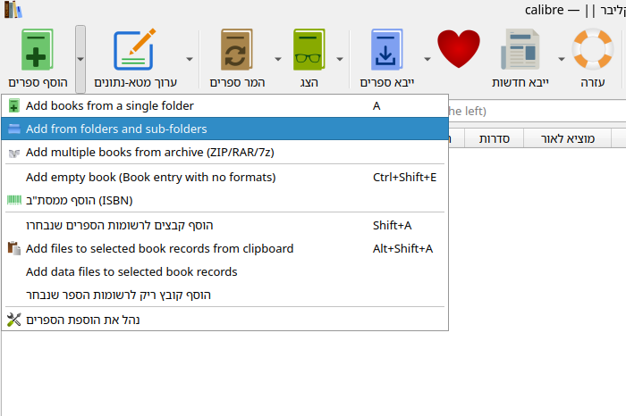
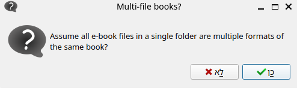
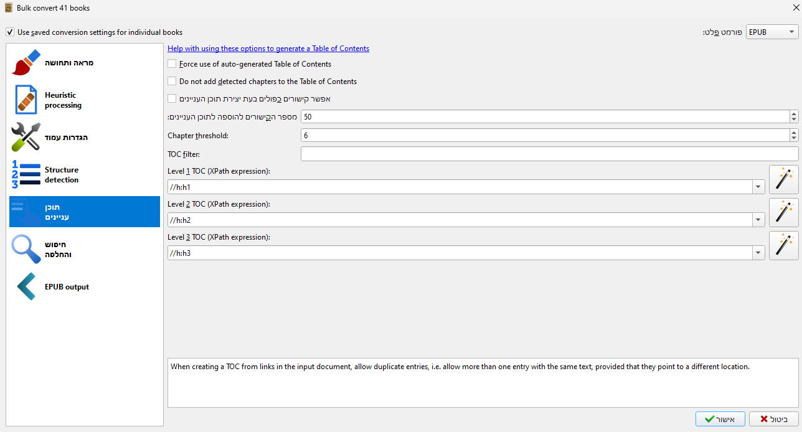

הסבר לגבי הרצת הסקריפטים
============
- 1: להעתיק את תיקיית Books מתיקיית ההתקנה של [תורת אמת](https://www.toratemetfreeware.com/index.html?downloads) (בדרך כלל בתיקיית מסמכים).
- 2: להריץ את הסקריפט [toratemet_1.py](toratemet_1.py), הסקריפט ימיר את הקבצים לקידוד html ויכניס כל קובץ לתיקייה עם שם הקובץ + קובץ טקסט עם מידע על הקובץ.
- 3: לפתוח את [calibre](https://calibre-ebook.com/download) ולייבא את הקבצים, לבחור באופציה של ייבוא מתיקיות ותתי תיקיות ולבחור "כן" בשאלה האם כל תיקייה מכילה גירסאות שונות של אותו הקובץ

- 4: להמיר לepub את כל הספרים שבפורמט zip, בתוכן העניינים יש להכניס את הטקסט הבא:

- 5: להריץ את הסקריפט [toratemet_2.py](toratemet_2.py).
- 6: אם ברצונכם ליצור עטיפה שתשקף את שם הספר יש לייבא שוב את הספרייה לקליבר, לייבא את הספרייה ולבחור "לא" בשאלה האם כל תיקייה מכילה גירסאות שונות של אותו הקובץ, להמיר את הקבצים לepub פעם נוספת ואז להריץ את הסקריפט [toratemet_3.py](toratemet_3.py).
### רעיונות לשיפורים:
הוספת המרת טעמי המקרא, סינון ספרים לא רלוונטים, המרה לepub מתוך הסקריפט, ובכך לקצר את התהליך, המרת "חברותא" ועוד ספרים בעייתיים בצורה נכונה, בדיקה מה הבעיה בספרים מסויימים בהמרה מansi לutf-8.

